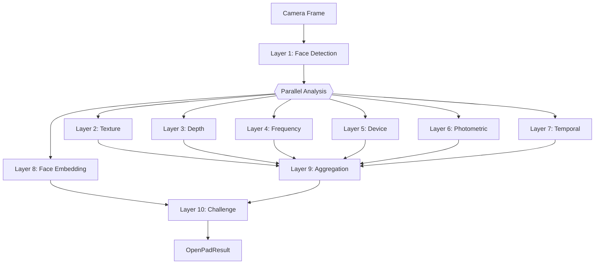
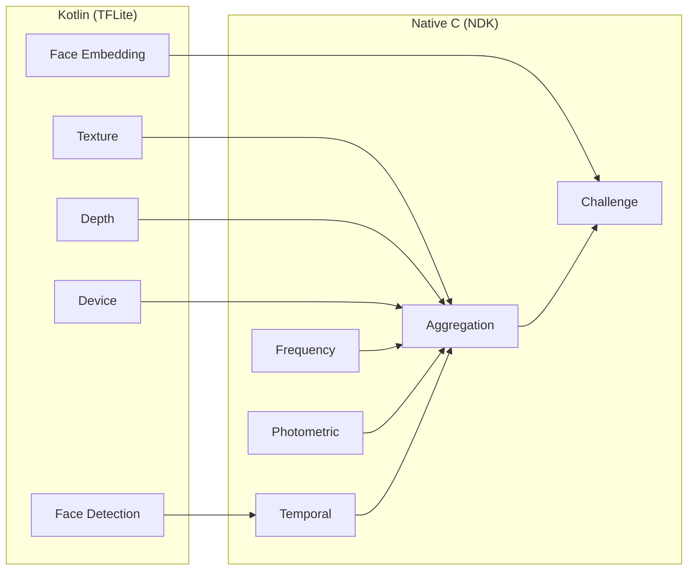
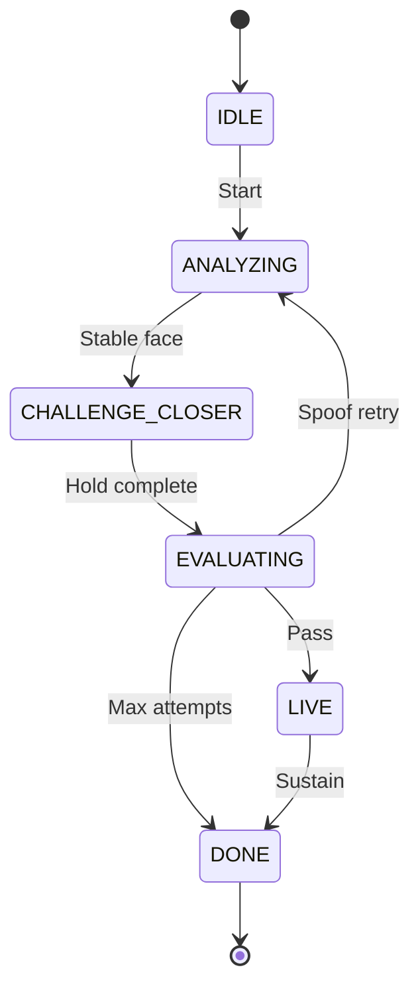

# OpenPAD SDK Architecture

Deep technical documentation covering data flow, per-layer analysis, security assessment, and model asset protection.

---

## High-Level Pipeline (Mermaid)



### Layer Responsibility Matrix



### Challenge-Response State Machine



---

## Data Flow (Detailed)

```
CameraX ImageProxy (YUV_420_888, front camera, 8 fps throttle)
    |
    v
BitmapConverter
    YUV420 -> NV21 -> JPEG (q=90) -> Bitmap -> rotate by EXIF
    Also: downsample 32x32 grayscale for frame similarity
    |
    v
LAYER 1: Face Detection (MediaPipeFaceDetector)
    Model:  face_detection.pad (BlazeFace, 128x128 RGB [-1,1])
    Decode: 896 SSD anchors, sigmoid scores, NMS (IoU 0.3, threshold 0.5)
    Output: FaceDetection(confidence, bbox, 6 keypoints) or null
    |
    +--- LAYER 2: Texture (MiniFasNetAnalyzer)
    |       Models: texture_2x7.pad (scale 2.7x) + texture_4x0.pad (scale 4.0x)
    |       Input:  80x80 BGR [0-255], two crop scales
    |       Output: [background, genuine, spoof] probabilities (averaged across models)
    |
    +--- LAYER 3: Depth (CdcnDepthAnalyzer)
    |       Model 1: depth_gate.pad (MN3, 128x128, fast ~50ms)
    |           If mn3RealScore >= 0.20 -> trigger CDCN
    |       Model 2: depth_map.pad (CDCN, 256x256 ImageNet-normalized)
    |           Output: 32x32 depth map [0-1], high = 3D, low = flat
    |
    +--- LAYER 4: Frequency (FftMoireDetector + LbpScreenDetector)
    |       FFT: 64x64 grayscale face crop, Hann window, 2D Cooley-Tukey FFT
    |           Output: moireScore, peakFrequency, spectralFlatness
    |       LBP: Local Binary Pattern histograms on face crop
    |           Output: screenScore, sharpnessUniformity
    |
    +--- LAYER 5: Device Detection (SsdDeviceDetector)
    |       Model: device_detection.pad (SSD MobileNet V1, 300x300 uint8 RGB)
    |       Detects: cell phone, laptop, TV, monitor in full frame
    |       Output: devicePresence score (boosted if overlapping face bbox)
    |
    +--- LAYER 6: Photometric (PhotometricAnalyzer)
    |       No ML model. Pure computation:
    |       - Specular highlight analysis (localized vs diffuse)
    |       - Chrominance distribution (YCbCr skin model)
    |       - Depth of field (quadrant sharpness variance)
    |       - Lighting direction consistency
    |
    +--- LAYER 7: Temporal (DefaultTemporalTracker)
    |       Sliding window (30 frames):
    |       - Frame similarity (32x32 grayscale MAD)
    |       - Head movement variance (face center tracking)
    |       - Blink detection (confidence dip-recovery pattern)
    |       - Movement smoothness (trajectory acceleration)
    |       - Face sharpness (Laplacian variance on 64x64 crop)
    |
    +--- LAYER 8: Face Embedding (MobileFaceNetAnalyzer)
            Model: face_embedding.pad (MobileFaceNet, batch-2 112x112 RGB)
            Checkpoint capture at ANALYZING and CHALLENGE_CLOSER phases
            At evaluation: cosine similarity of 192-dim L2-normalized embeddings
            Below 0.70 threshold -> face swap detected -> hard spoof
    |
    v
LAYER 9: Aggregation (WeightedAggregator + StateStabilizer)
    Decision gates (evaluated in order):
      1. Not enough frames -> ANALYZING
      2. No face / low confidence -> NO_FACE
      3. Device gate (SSD MobileNet) -> SPOOF_SUSPECTED
      4. Frequency gate (moire + LBP both flagged) -> SPOOF_SUSPECTED
      5. Texture gate (MiniFASNet) -> SPOOF_SUSPECTED
      6. CDCN depth gate -> SPOOF_SUSPECTED
      7. Photometric gate (combined score too low) -> SPOOF_SUSPECTED
      8. All signals pass -> LIVE

    Weighted ML score for challenge evaluation:
      Texture: 15% | MN3: 20% | CDCN: 55% | Device: 10%

    State stabilizer (hysteresis):
      Enter SPOOF: 5 consecutive frames
      Enter LIVE: 8 consecutive frames
      NO_FACE: immediate
    |
    v
LAYER 10: Challenge-Response (MovementChallenge)
    State machine:
      IDLE -> ANALYZING -> POSITIONING -> CHALLENGE_CLOSER
           -> EVALUATING -> LIVE -> DONE

    CHALLENGE_CLOSER: face area must increase 15%+ from baseline
    EVALUATING: face match check + weighted score vs threshold
    Threshold: 0.70 base, +0.08 per failed attempt (max 0.85)
    Unlimited retries
    |
    v
OpenPadResult (isLive, confidence, durationMs, spoofAttempts,
               depthCharacteristics, faceAtNormalDistance, faceAtCloseDistance)
```

---

## Per-Layer Analysis

### Layer 1 -- Face Detection

**Implementation**: `MediaPipeFaceDetector.kt` (197 lines)
**Model**: BlazeFace short-range, 128x128 input, ~4ms inference

| Aspect | Assessment |
|--------|-----------|
| Accuracy | Good for frontal faces at arm's length to close range |
| Speed | ~4ms per frame, well within 8fps budget |
| Failure modes | Profile faces, extreme lighting, partial occlusion |
| Keypoints | 6 points (eyes, nose, mouth, ears) |

### Layer 2 -- Texture Analysis

**Implementation**: `MiniFasNetAnalyzer.kt` (309 lines)
**Models**: MiniFASNetV2 (2.7x scale) + MiniFASNetV1SE (4.0x scale)

Two models run at different face crop scales. The V1SE variant includes Squeeze-and-Excitation attention for improved discrimination. Scores are averaged for a multi-scale ensemble.

| Aspect | Assessment |
|--------|-----------|
| What it catches | Paper grain, screen sub-pixels, print texture |
| Input | 80x80 BGR [0-255] face crops at 2 scales |
| Output | 3-class softmax: [background, genuine, spoof] |
| Ensemble | Score averaging across both models |

### Layer 3 -- Depth Analysis

**Implementation**: `CdcnDepthAnalyzer.kt` (230 lines)
**Architecture**: Cascaded -- fast MN3 gate filters before expensive CDCN

| Model | Role | Input | Output |
|-------|------|-------|--------|
| MN3 (depth_gate) | Fast gate (~50ms) | 128x128 RGB [0-255] | 2-class logits (real/spoof) |
| CDCN (depth_map) | Depth map (~1200ms) | 256x256 RGB (ImageNet norm) | 32x32 depth map [0-1] |

MN3 runs every frame. CDCN only fires when `mn3Score >= 0.20`.

### Layer 4 -- Frequency Analysis

**Implementation**: `FftMoireDetector.kt` (232 lines) + `LbpScreenDetector.kt` (316 lines)

Pure Kotlin, no ML model. Two complementary detectors:

- **FFT Moire**: Detects periodic screen artifacts via radial power spectrum analysis
- **LBP Screen**: Detects uniform pixel grid patterns characteristic of screens

### Layer 5 -- Device Detection

**Implementation**: `SsdDeviceDetector.kt` (211 lines)
**Model**: SSD MobileNet V1 COCO (300x300 uint8 RGB)

Detects presentation devices in the full camera frame. Detection confidence is boosted when the device bounding box overlaps the face region.

### Layer 6 -- Photometric Analysis

**Implementation**: `PhotometricAnalyzer.kt` (457 lines)

No ML model. Analyzes physical light properties:
- Specular highlights (localized on 3D face vs diffuse on screens)
- Chrominance distribution (skin color model in YCbCr)
- Depth of field (non-uniform sharpness at close range)
- Lighting consistency (illumination direction across face)

### Layer 7 -- Temporal Signals

**Implementation**: `DefaultTemporalTracker.kt` (205 lines)

Sliding window (30 frames) tracking:

| Signal | What it detects | Reliability |
|--------|----------------|-------------|
| Frame similarity | Static images (photo held still) | Strong |
| Movement variance | Presence of micro-movements | Moderate |
| Blink detection | Eye blink via confidence dip | Weak |
| Movement smoothness | Trajectory acceleration | Weak |
| Face sharpness | Laplacian variance on face crop | Moderate |

### Layer 8 -- Face Consistency

**Implementation**: `MobileFaceNetAnalyzer.kt` (180 lines)
**Model**: MobileFaceNet (batch-2, 112x112 RGB [-1,1])

Silently captures face bitmaps at two checkpoints during the challenge:
1. Baseline (face at normal distance)
2. Challenge completion (face closer, hold phase done)

At evaluation, both crops are fed into MobileFaceNet in a single batch-2 inference. Cosine similarity below 0.70 triggers a hard spoof verdict.

| Property | Value |
|----------|-------|
| Input | [2, 112, 112, 3] RGB [-1,1] NHWC |
| Output | [2, 192] float32 embedding |
| Threshold | 0.70 cosine similarity |
| Inference | ~10ms (single batch call) |

---

## Model Asset Protection

Models are stored as `.pad` files -- not raw `.tflite`. The packing process:

```
Build time:  .tflite -> gzip (level 9) -> XOR (32-byte key) -> .pad
Runtime:     .pad -> XOR (same key) -> gunzip -> ByteBuffer -> TFLite Interpreter
```

This prevents:
- Direct extraction and renaming of model files from the APK
- Casual identification of models by file signature or extension
- Simple decompilation-based model theft

The XOR key is embedded in both `scripts/pack_models.py` and `ModelLoader.kt`. This is obfuscation, not cryptographic encryption -- a determined reverse engineer can extract the key from decompiled bytecode.

**ModelLoader.kt** loads `.pad` files via:
1. Read asset bytes
2. XOR-descramble with 32-byte rotating key
3. Decompress with `GZIPInputStream`
4. Wrap in `ByteBuffer.allocateDirect()` with `nativeOrder()`
5. Pass to TFLite `Interpreter`

---

## SDK UI Architecture

### Screen Flow

```
IntroScreen --[Begin]--> CameraScreen --[verdict]--> VerdictScreen
                              |                          |
                              |                    [Retry] -> CameraScreen
                              |
                         [Close] -> onCancelled()
```

### Screen Details

**IntroScreen**: Shield icon with checkmark, instructions text, gradient background, "Begin Verification" button. Uses entrance animation (`AnimatedVisibility` with fade + slide).

**CameraScreen**: Layered with explicit z-ordering:
- z=0: CameraX preview
- z=1: `FaceGuideOverlay` -- animated face oval with radial gradient scrim, color-coded borders (idle/analyzing/live/spoof), corner accent brackets, spring-based progress arc
- z=2: Top gradient scrim + bottom gradient scrim
- z=3: Interactive elements -- frosted close button, phase title (with `AnimatedContent` crossfade), step indicator dots, instruction pill

**VerdictScreen**: Animated shield icon with status-dependent checkmark or X. Confidence percentage, description text, retry/close buttons. Edge-to-edge with status bar insets.

### Animations

- Screen transitions: `fadeIn`/`fadeOut` + `slideInHorizontally`/`slideOutHorizontally` + `scaleIn`/`scaleOut`
- Face oval border: `animateColorAsState` between idle/analyzing/live/spoof colors
- Progress arc: `animateFloatAsState` with spring physics
- Phase title: `AnimatedContent` with vertical slide + crossfade
- Instruction pill: border color animates based on status

### Theme System

`OpenPadThemeConfig` (public, ARGB hex longs) -> `PadColors` (internal, Compose `Color` getters) -> `OpenPadTheme` (Compose `MaterialTheme`)

Each `PadColors` property is a `get()` that reads from `OpenPad.theme`, allowing runtime color changes between sessions.

---

## Security Assessment

### Attack Coverage

| Attack Type | Difficulty | Detected? | Primary Signal |
|-------------|-----------|-----------|----------------|
| Printed photo (still) | Trivial | Yes | Frame similarity ~1.0 |
| Printed photo (hand-held) | Easy | Yes | Texture + depth + DOF |
| Phone screen (static) | Easy | Yes | Frame similarity + device detection |
| Phone screen (video) | Moderate | Moderate | Depth + texture + frequency gate |
| OLED screen (video + challenge) | Moderate | Moderate | Depth + device + photometric |
| Face swap mid-challenge | Hard | Yes | Face embedding similarity |
| 3D mask | Hard | No | No depth sensing |
| Deepfake on screen | Hard | No | Same as video replay |
| Injection (rooted device) | Hard | No | Client-side only |

### Limitations

1. **Single RGB camera** -- no hardware depth. 3D masks are undetectable.
2. **Single fixed challenge** -- "move closer" is predictable after one use.
3. **Client-side only** -- no server verification, no challenge-nonce binding.
4. **Obfuscation, not encryption** -- model weights can be extracted by a determined attacker.

---

## Configuration Internals

All configurable thresholds live in `PadConfig.kt` (internal) and are mapped from `OpenPadConfig` (public API) via `toPadConfig()`.

| Public Name | Internal Name | Default | Effect |
|-------------|--------------|---------|--------|
| `livenessThreshold` | `genuineProbabilityThreshold` | 0.70 | Minimum score for LIVE verdict |
| `faceMatchThreshold` | `faceConsistencyThreshold` | 0.70 | Minimum embedding similarity |
| `faceDetectionConfidence` | `minFaceConfidence` | 0.55 | Face detection cutoff |
| `textureAnalysisWeight` | `textureWeight` | 0.15 | Texture score weight |
| `depthGateWeight` | `mn3Weight` | 0.20 | MN3 score weight |
| `depthAnalysisWeight` | `cdcnWeight` | 0.55 | CDCN score weight |
| `screenDetectionWeight` | `deviceWeight` | 0.10 | Device detection weight |
| `depthGateMinScore` | `mn3GateThreshold` | 0.20 | MN3 gate for CDCN |
| `depthFlatnessMinScore` | `depthFlatnessThreshold` | 0.40 | Hard CDCN flat cutoff |
| `screenDetectionMinConfidence` | `deviceConfidenceThreshold` | 0.50 | Device detection cutoff |
| `moireDetectionThreshold` | `moireThreshold` | 0.60 | Moire score above this flags screen |
| `screenPatternThreshold` | `lbpScreenThreshold` | 0.70 | LBP screen score above this flags screen |
| `photometricMinScore` | `photometricMinScore` | 0.30 | Photometric below this flags spoof |
| `spoofAttemptPenalty` | `spoofAttemptPenaltyPerCount` | 0.08 | Per-attempt escalation |
| `maxFramesPerSecond` | `maxFps` | 8 | Frame processing rate |
| _(removed)_ | `maxSpoofAttempts` | 0 | Unlimited retries (0 = no limit) |

---

## Test Coverage

| Test Class | Tests | Coverage |
|-----------|-------|---------|
| `StateStabilizerTest` | 7 | Hysteresis transitions, NO_FACE immediacy, enter/exit thresholds, reset |
| `WeightedAggregatorTest` | 8 | All classifier rules, score computation, null handling |
| `FftMoireDetectorTest` | 4 | Frequency detection, DC signal, FFT roundtrip |
| `PhotometricAnalyzerTest` | 4+ | Specular, chrominance, DOF analysis |
| `DefaultTemporalTrackerTest` | 10 | Frame counting, movement, smoothness, blink, reset |

**Not unit tested** (require device or Robolectric):
- TFLite model inference (all analyzers)
- BitmapConverter (Android APIs)
- PadFrameAnalyzer (full pipeline)
- MovementChallenge (state machine)
- PadViewModel (coroutines + StateFlow)

---

## Dependencies

| Dependency | Version | Purpose |
|-----------|---------|---------|
| AGP | 8.10.0 | Build system |
| Kotlin | 2.2.0 | Language |
| CameraX | 1.4.2 | Camera preview + frame analysis |
| Compose BOM | 2026.01.01 | UI (Material3) |
| Lifecycle | 2.8.7 | ViewModel + Compose integration |
| LiteRT | 1.0.1 | TFLite model inference |
| Timber | 5.0.1 | Logging |

No dependency injection framework. Manual construction in `PadPipeline.create()`.
