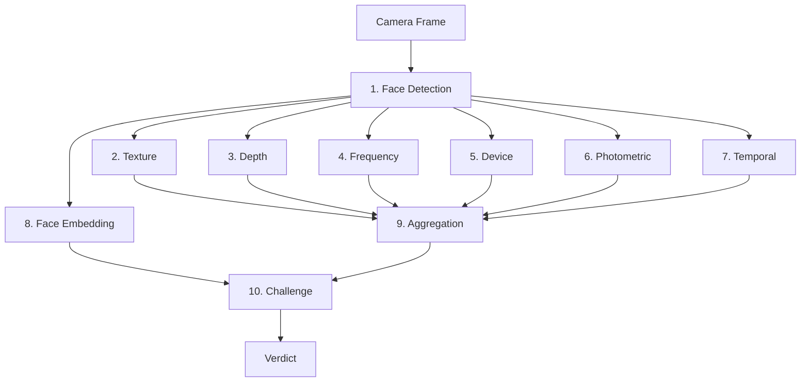
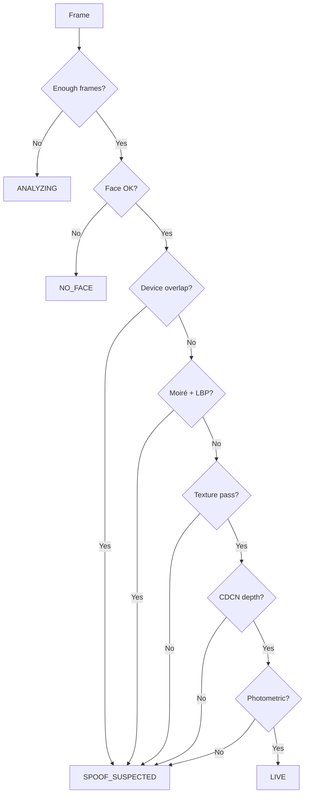

# OpenPAD SDK

On-device Presentation Attack Detection (face liveness) for Android. Detects face spoofing -- photos, screens, video replays, face swaps -- using a multi-layer ML pipeline. All processing runs locally. No server dependency, no cloud calls, no data leaves the device.

**Requirements**: Android 8.0+ (API 26), front-facing camera.

---

## Integration Guide

### 1. Add the dependency

**Option A: JitPack (published SDK)**

1. Add the JitPack repository in `settings.gradle.kts`:

```kotlin
dependencyResolutionManagement {
    repositories {
        google()
        mavenCentral()
        maven { url = uri("https://jitpack.io") }
    }
}
```

2. Add the dependency (replace `YourGitHubUsername` with the repo owner and `VERSION` with a tag or commit, e.g. `1.0.0`):

```kotlin
dependencies {
    implementation("com.github.YourGitHubUsername:OpenPAD:VERSION")
}
```

To publish a release: push a Git tag (e.g. `1.0.0`). JitPack will build and serve the `pad-core` AAR. See [JitPack docs](https://docs.jitpack.io/android/).

**Option B: Local module**

Include the `pad-core` module in your project (e.g. as a Git submodule or copied source) and add `implementation(project(":pad-core"))`.

### 2. Initialize

Call `initialize()` once at app startup (e.g. in `Application.onCreate()`). This loads all ML models asynchronously.

```kotlin
OpenPad.initialize(context) {
    // SDK is ready
}
```

With custom configuration:

```kotlin
OpenPad.initialize(
    context = applicationContext,
    config = OpenPadConfig(
        livenessThreshold = 0.70f,
        faceMatchThreshold = 0.70f,
        maxRetries = 3
    ),
    onReady = { /* ready */ },
    onError = { error -> Log.e("PAD", error.toString()) }
)
```

### 3a. UI Mode -- Full Verification Flow

Launch the built-in verification UI. The SDK handles camera, challenge-response, and verdict screens.

```kotlin
OpenPad.analyze(activity, object : OpenPadListener {
    override fun onLiveConfirmed(result: OpenPadResult) {
        // Verified live: result.confidence, result.durationMs
    }

    override fun onSpoofDetected(result: OpenPadResult) {
        // Spoof detected: result.spoofAttempts
    }

    override fun onError(error: OpenPadError) {
        // Initialization, camera, or permission error
    }

    override fun onCancelled() {
        // User closed the flow
    }
})
```

### 3b. Headless Mode -- Bring Your Own Camera

For integrators who want to use their own camera UI. The SDK provides a frame analyzer and reactive state flows.

```kotlin
val session = OpenPad.createSession(listener) ?: return

// Plug into CameraX
val imageAnalysis = ImageAnalysis.Builder().build()
imageAnalysis.setAnalyzer(executor, session.frameAnalyzer)

// Observe state to drive your own UI
lifecycleScope.launch {
    session.status.collect { status -> /* ANALYZING, LIVE, SPOOF_SUSPECTED */ }
}
lifecycleScope.launch {
    session.phase.collect { phase -> /* CHALLENGE_CLOSER, EVALUATING, etc. */ }
}
lifecycleScope.launch {
    session.instruction.collect { text -> /* "Move closer", "Hold still" */ }
}
lifecycleScope.launch {
    session.challengeProgress.collect { progress -> /* 0.0 to 1.0 */ }
}

// When done
session.release()
```

### 4. Theme Customization (UI Mode)

All SDK screens use a customizable color theme. Set it before calling `analyze()`.

```kotlin
OpenPad.theme = OpenPadThemeConfig(
    primary = 0xFF1565C0,        // Buttons, progress arcs
    success = 0xFF2E7D32,        // Live-confirmed accent
    error = 0xFFD32F2F,          // Spoof-detected accent
    surface = 0xFF121212,        // Background
    surfaceVariant = 0xFF1E1E1E, // Elevated panels
    onSurface = 0xFFE0E0E0,     // Text color
    onSurfaceHigh = 0xFFFFFFFF,  // High-emphasis text
    scrim = 0xFF121212,          // Overlay outside face oval
    frostGlass = 0xFF1E1E1E,    // Frosted panel backgrounds
    ovalIdle = 0xFFE0E0E0,      // Face oval border (idle)
    divider = 0xFF333333         // Separator lines
)
```

Colors are ARGB hex `Long` values to keep the public API free of Compose dependencies.

### 5. Cleanup

```kotlin
OpenPad.release()
```

---

## Configuration Reference

All parameters are optional. Defaults are tuned for balanced security/usability.

```kotlin
OpenPadConfig(
    // --- Verdict ---
    livenessThreshold = 0.70f,           // Minimum overall confidence to accept as live
    faceMatchThreshold = 0.70f,          // Minimum face similarity between checkpoints (face swap detection)
    maxRetries = 3,                       // Retry attempts after spoof detection before terminal failure
    spoofAttemptPenalty = 0.08f,          // Extra threshold per consecutive failed attempt

    // --- Detection ---
    faceDetectionConfidence = 0.55f,     // Minimum face detection confidence

    // --- Scoring Weights (should sum to ~1.0) ---
    textureAnalysisWeight = 0.15f,       // Surface texture patterns (print/screen artifacts)
    depthGateWeight = 0.20f,             // Fast depth pre-filter
    depthAnalysisWeight = 0.55f,         // Full 3D depth map analysis (primary discriminator)
    screenDetectionWeight = 0.10f,       // Phone/laptop/tablet screen in frame

    // --- Model Thresholds ---
    depthGateMinScore = 0.20f,           // Score to trigger full depth analysis (lower = more permissive)
    depthFlatnessMinScore = 0.40f,       // Hard cutoff: faces flatter than this are rejected
    screenDetectionMinConfidence = 0.50f, // Screen detection confidence to count as a signal

    // --- Classical Signal Thresholds ---
    moireDetectionThreshold = 0.60f,     // Moire score above this flags screen artifacts
    screenPatternThreshold = 0.70f,      // LBP screen pattern score above this flags screen
    photometricMinScore = 0.30f,         // Combined photometric score below this flags spoof

    // --- Performance ---
    maxFramesPerSecond = 8,              // Frame processing rate
    enableDebugOverlay = false           // Show real-time debug metrics
)
```

---

## Public API

| Class | Purpose |
|-------|---------|
| `OpenPad` | Singleton entry point. `initialize()`, `analyze()`, `createSession()`, `release()`. |
| `OpenPadConfig` | All tunable thresholds, weights, and limits. |
| `OpenPadThemeConfig` | UI color customization (ARGB hex longs). |
| `OpenPadListener` | Callback interface: `onLiveConfirmed`, `onSpoofDetected`, `onError`, `onCancelled`. |
| `OpenPadResult` | Verdict: `isLive`, `confidence`, `durationMs`, `spoofAttempts`. |
| `OpenPadError` | Sealed class: `NotInitialized`, `InitializationFailed`, `CameraUnavailable`, `PermissionDenied`, `AlreadyRunning`. |
| `OpenPadSession` | Headless session: `frameAnalyzer`, `status`, `phase`, `challengeProgress`, `instruction`, `release()`. |

---

## Architecture

### Pipeline Overview



| Layer | Component | Type |
|-------|-----------|------|
| 1 | Face Detection (BlazeFace) | ML |
| 2 | Texture (MiniFASNet V2 + V1SE) | ML |
| 3 | Depth (MN3 gate → CDCN) | ML |
| 4 | Frequency (FFT moiré + LBP) | Native C |
| 5 | Device (SSD MobileNet) | ML |
| 6 | Photometric (specular, chrominance, DOF, lighting) | Native C |
| 7 | Temporal (movement, blink, similarity) | Native C |
| 8 | Face Embedding (MobileFaceNet) | ML |
| 9 | Aggregation (gates + stabilizer) | Native C |
| 10 | Challenge-Response ("move closer") | Native C |

### Detection Layers

| Layer | What It Detects | Type | Role in Pipeline |
|-------|----------------|------|------------------|
| Texture | Paper grain, screen sub-pixels, skin micro-texture | Learned (CNN) | Gate + ML score (15%) |
| Depth | Flat surfaces vs 3D face geometry | Learned (CNN) | Gate + ML score (20% + 55%) |
| Frequency | Moire patterns, screen pixel grids | Classical (FFT + LBP) | Gate (moire + LBP both flagged) |
| Device | Phone, laptop, TV, monitor in frame | Learned (object detection) | Gate + ML score (10%) |
| Photometric | Specular reflections, color temperature, uniform DOF | Classical | Gate (combined score too low) |
| Temporal | Static images, missing blinks, replay patterns | Classical | Pre-classification (frames, face presence) |
| Face Match | Face swap mid-challenge | Learned (embedding) | Separate check at challenge evaluation |

### Classification Gates

Per-frame classification uses sequential decision gates (first match wins):



1. Not enough frames → ANALYZING  
2. No face / low confidence → NO_FACE  
3. **Device gate**: phone/laptop/TV overlapping face → SPOOF_SUSPECTED  
4. **Frequency gate**: moire + LBP both above threshold → SPOOF_SUSPECTED  
5. **Texture gate**: MiniFASNet genuine score below threshold → SPOOF_SUSPECTED  
6. **CDCN depth gate**: depth below flatness threshold → SPOOF_SUSPECTED  
7. **Photometric gate**: combined score below threshold → SPOOF_SUSPECTED  
8. All signals pass → LIVE

### ML Aggregate Score

The challenge evaluation score is a weighted sum of four ML model signals:

| Signal | Weight | Role |
|--------|--------|------|
| Texture analysis | 15% | Surface micro-texture discrimination |
| Depth gate (MN3) | 20% | Fast binary live/spoof signal |
| Depth map (CDCN) | 55% | Primary depth discriminator |
| Screen detection | 10% | Replay device presence |

When CDCN is unavailable, its weight redistributes to texture (2/3) and MN3 (1/3). Classical signals (frequency, photometric) act as gates but do not contribute to the continuous score.

### Challenge-Response Flow

```
IDLE -> ANALYZING -> POSITIONING -> CHALLENGE_CLOSER -> EVALUATING -> LIVE -> DONE
```

1. **ANALYZING** -- Wait for stable face detection
2. **POSITIONING** -- Face must be centered and in range
3. **CHALLENGE_CLOSER** -- User must move closer (15%+ face area increase). ML scores collected during hold phase.
4. **EVALUATING** -- Face match check (MobileFaceNet) + weighted score evaluation against threshold
5. **LIVE** -- 1s sustain timer, then verdict delivered
6. **DONE** -- Terminal state

Failed attempts restart from ANALYZING with escalating threshold (+0.08 per attempt). Maximum 3 attempts before terminal failure.

### UI Flow (UI Mode)

```
IntroScreen -> CameraScreen (with FaceGuideOverlay) -> VerdictScreen
```

- **IntroScreen**: Shield icon, instructions, "Begin Verification" button
- **CameraScreen**: Live camera preview with animated face oval, phase indicators, instruction pill, gradient scrims
- **VerdictScreen**: Animated shield with checkmark (live) or X (spoof), confidence display, retry option

Transitions use `AnimatedContent` with crossfade + slide + scale animations.

---

## Model Assets

All models are stored as `.pad` files (gzip-compressed, XOR-scrambled) in `pad-core/src/main/assets/models/`. This prevents casual extraction and renaming of the TFLite models from the APK.

| File | Original Size | Packed Size | Purpose |
|------|--------------|-------------|---------|
| `face_detection.pad` | 225 KB | 195 KB | BlazeFace face detection |
| `texture_2x7.pad` | 1.7 MB | 1.5 MB | Texture analysis (2.7x crop scale) |
| `texture_4x0.pad` | 1.7 MB | 1.5 MB | Texture analysis (4.0x crop scale) |
| `depth_gate.pad` | 5.8 MB | 5.3 MB | MN3 fast depth gate |
| `depth_map.pad` | 3.4 MB | 3.2 MB | CDCN depth map |
| `device_detection.pad` | 4.0 MB | 2.8 MB | SSD MobileNet screen detection |
| `face_embedding.pad` | 5.0 MB | 4.6 MB | MobileFaceNet face consistency |
| **Total** | **21.8 MB** | **19.2 MB** | |

### Model Packing

Models are packed at build time using `scripts/pack_models.py`:

```bash
# Pack: .tflite -> .pad (gzip + XOR)
python scripts/pack_models.py

# Unpack: .pad -> .tflite (reverse)
python scripts/pack_models.py --unpack
```

At runtime, `ModelLoader.kt` reverses the process: XOR-descramble with a 32-byte key, then gzip-decompress into a `ByteBuffer` for the TFLite interpreter.

### Model Licenses

| Model | License | Source |
|-------|---------|--------|
| BlazeFace | Apache 2.0 | Google/MediaPipe |
| MiniFASNet V2 + V1SE | Apache 2.0 | MiniVision (Silent-Face-Anti-Spoofing) |
| Anti-Spoof MN3 | MIT | kprokofi (PINTO Model Zoo) |
| CDCN depth map | In-house trained | Architecture from CDCN paper (arXiv:2003.04092) |
| SSD MobileNet V1 COCO | Apache 2.0 | TensorFlow |
| MobileFaceNet | MIT | syaringan357 |

---

## Project Structure

```
pad-open/
├── app/                                    # Demo app
│   └── src/main/java/com/openpad/app/
│       ├── OpenPadApp.kt                   # Application class (initialization + theme)
│       ├── MainActivity.kt                 # UI mode + headless mode launcher
│       └── HeadlessActivity.kt             # Headless integration demo
│
├── pad-core/                               # SDK library module
│   ├── src/main/cpp/                       # Native C layer (see cpp/README.md)
│   │   ├── include/openpad/                # Public headers
│   │   └── src/                            # JNI, core, image, frequency, photometric, temporal, decision
│   └── src/main/java/com/openpad/core/
│       │
│       ├── OpenPad.kt                      # Singleton entry point
│       ├── OpenPadConfig.kt                # Public configuration
│       ├── OpenPadThemeConfig.kt            # UI theme colors
│       ├── OpenPadListener.kt              # Result callback interface
│       ├── OpenPadResult.kt                # Verdict data class
│       ├── OpenPadError.kt                 # Error types
│       ├── OpenPadSession.kt               # Headless session interface + impl
│       ├── PadConfig.kt                    # Internal pipeline thresholds
│       ├── PadPipeline.kt                  # Pipeline factory
│       ├── PadResult.kt                    # Per-frame result
│       │
│       ├── detection/                      # Layer 1: Face detection
│       │   ├── MediaPipeFaceDetector.kt    #   BlazeFace inference + SSD decode
│       │   ├── FaceDetection.kt            #   Face data class
│       │   └── FaceDetector.kt             #   Interface
│       │
│       ├── texture/                        # Layer 2: Texture analysis
│       │   ├── MiniFasNetAnalyzer.kt       #   Multi-scale MiniFASNet ensemble
│       │   ├── TextureAnalyzer.kt          #   Interface
│       │   └── TextureResult.kt            #   Result data class
│       │
│       ├── depth/                          # Layer 3: Depth analysis
│       │   ├── CdcnDepthAnalyzer.kt        #   MN3 + CDCN cascaded inference
│       │   ├── CascadedDepthAnalyzer.kt    #   Cascade orchestration
│       │   ├── DepthAnalyzer.kt            #   Interface
│       │   └── DepthResult.kt              #   Result data class
│       │
│       ├── frequency/                      # Layer 4: Frequency analysis
│       │   ├── FftMoireDetector.kt         #   2D FFT moire detection
│       │   ├── LbpScreenDetector.kt        #   LBP screen texture detection
│       │   ├── FrequencyAnalyzer.kt        #   Interface
│       │   ├── FrequencyResult.kt          #   FFT result
│       │   └── LbpResult.kt               #   LBP result
│       │
│       ├── device/                         # Layer 5: Device detection
│       │   ├── SsdDeviceDetector.kt        #   SSD MobileNet inference
│       │   ├── DeviceDetector.kt           #   Interface
│       │   └── DeviceDetectionResult.kt    #   Result data class
│       │
│       ├── photometric/                    # Layer 6: Photometric analysis
│       │   ├── PhotometricAnalyzer.kt      #   Specular, chrominance, DOF, lighting
│       │   └── PhotometricResult.kt        #   Result data class
│       │
│       ├── signals/                        # Layer 7: Temporal signals
│       │   ├── DefaultTemporalTracker.kt   #   Sliding window tracker
│       │   ├── TemporalSignalTracker.kt    #   Interface
│       │   └── TemporalFeatures.kt         #   Features data class
│       │
│       ├── embedding/                      # Layer 8: Face embedding
│       │   ├── MobileFaceNetAnalyzer.kt    #   Face consistency verification
│       │   ├── FaceEmbeddingAnalyzer.kt    #   Interface
│       │   └── FaceEmbeddingResult.kt      #   Result data class
│       │
│       ├── aggregation/                    # Layer 9: Aggregation
│       │   ├── WeightedAggregator.kt       #   Rule gates + weighted fusion
│       │   ├── StateStabilizer.kt          #   Hysteresis state machine
│       │   ├── ScoreAggregator.kt          #   Interface
│       │   └── PadStatus.kt               #   Status enum
│       │
│       ├── challenge/                      # Layer 10: Challenge-response
│       │   ├── MovementChallenge.kt        #   "Move closer" state machine
│       │   ├── ChallengeManager.kt         #   Interface
│       │   └── ChallengeState.kt           #   Phase enum + evidence
│       │
│       ├── analyzer/                       # Frame processing
│       │   ├── PadFrameAnalyzer.kt         #   CameraX analyzer orchestration
│       │   └── BitmapConverter.kt          #   YUV conversion, similarity, sharpness
│       │
│       ├── model/                          # Model loading
│       │   └── ModelLoader.kt              #   .pad decryption + TFLite loading
│       │
│       └── ui/                             # Built-in SDK UI
│           ├── PadActivity.kt              #   Host activity with screen transitions
│           ├── IntroScreen.kt              #   Welcome screen
│           ├── CameraScreen.kt             #   Camera preview with overlay
│           ├── FaceGuideOverlay.kt         #   Animated face oval
│           ├── VerdictScreen.kt            #   Result screen
│           ├── theme/OpenPadTheme.kt       #   Compose theme (reads OpenPadThemeConfig)
│           └── viewmodel/                  #   MVI state management
│               ├── PadViewModel.kt
│               ├── PadUiState.kt
│               └── PadIntent.kt
│
├── scripts/
│   └── pack_models.py                      # Gzip + XOR model packer
│
└── gradle/libs.versions.toml              # Dependency version catalog
```

---

## Building

```bash
# Build everything
./gradlew :pad-core:build :app:build

# Install demo app
./gradlew :app:installDebug

# Run unit tests
./gradlew :pad-core:test
```

---

## Dependencies

| Dependency | Version | Purpose |
|-----------|---------|---------|
| AGP | 8.10.0 | Build system |
| Kotlin | 2.2.0 | Language |
| CameraX | 1.4.2 | Camera preview + frame analysis |
| Compose BOM | 2026.01.01 | UI (Material3) |
| Lifecycle | 2.8.7 | ViewModel + Compose integration |
| LiteRT | 1.0.1 | TFLite model inference |
| Timber | 5.0.1 | Logging |

---

## Detection Capabilities

| Attack Type | Detection | Primary Signals |
|-------------|-----------|-----------------|
| Printed photo (still) | Strong | Frame similarity + texture + temporal |
| Printed photo (hand-held) | Strong | Texture + depth + DOF variance |
| LCD screen (static) | Strong | FFT moire + LBP + texture + device detection |
| Phone screen (static image) | Strong | Texture + depth + device detection |
| Phone screen (video replay) | Moderate | Depth + texture + LBP |
| High-PPI OLED replay | Moderate | Depth + device detection + photometric |
| Face swap mid-challenge | Strong | Face embedding consistency (MobileFaceNet) |
| 3D printed/silicone mask | Weak | No depth sensing from single RGB camera |

---

## Android Compatibility

- **Edge-to-edge**: All SDK screens handle system bar insets correctly (status bar, navigation bar)
- **16KB page alignment**: Native libraries use `useLegacyPackaging = false` for Android 15+ compatibility
- **Minimum SDK**: API 26 (Android 8.0)
- **Target SDK**: API 35

---

## Known Limitations

1. **Single RGB camera** -- no hardware depth sensing. 3D mask attacks cannot be reliably detected.
2. **Single fixed challenge** -- "move closer" is predictable. Randomized multi-challenge is on the roadmap.
3. **Client-side only** -- all decisions on-device. A rooted device can bypass the pipeline.
4. **Model weights are obfuscated, not encrypted** -- XOR scrambling deters casual extraction but is not cryptographically secure.

---

## See Also

- [ARCHITECTURE.md](ARCHITECTURE.md) — Deep technical docs, security analysis, threat model, threshold tuning guide
- [pad-core/src/main/cpp/README.md](pad-core/src/main/cpp/README.md) — Native C layer: architecture, Mermaid diagrams, wire format, build
