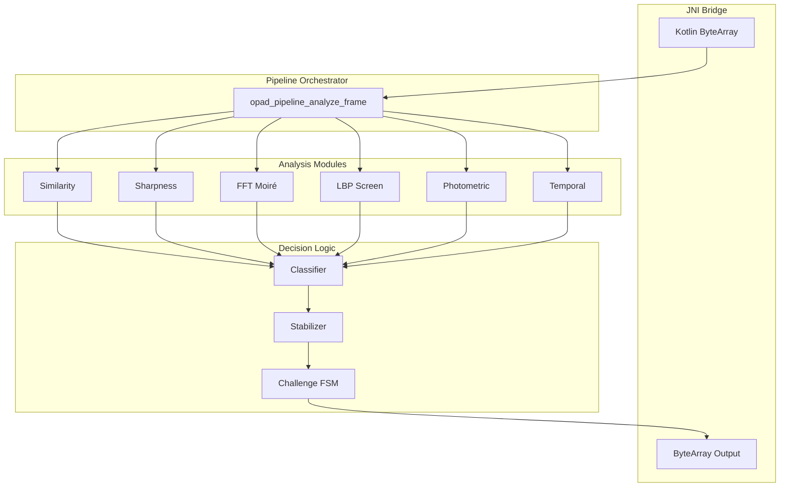
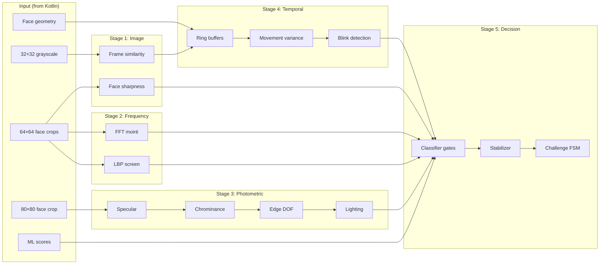
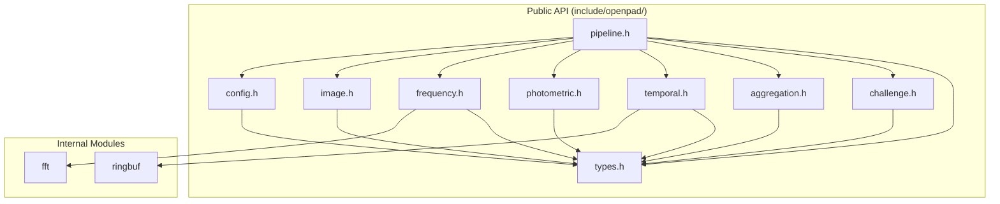
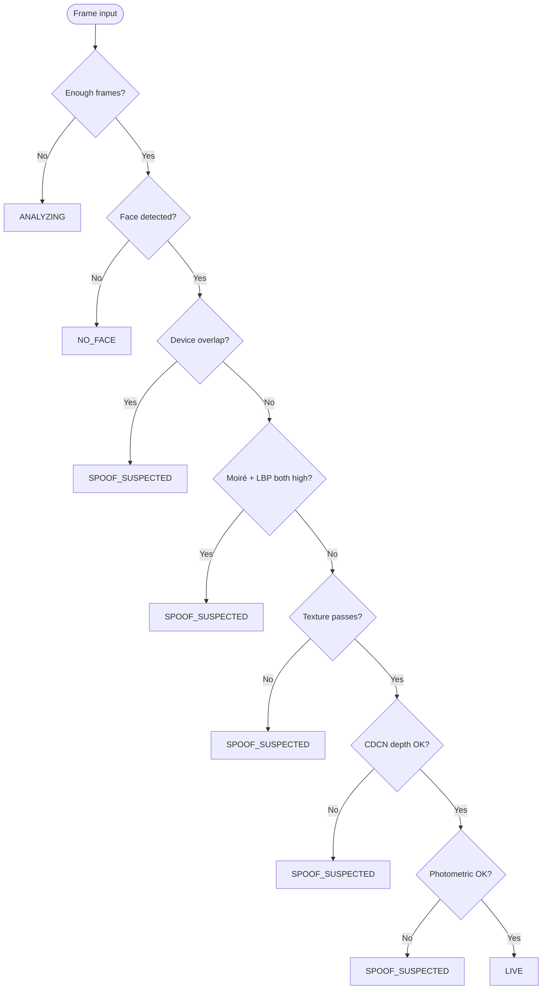
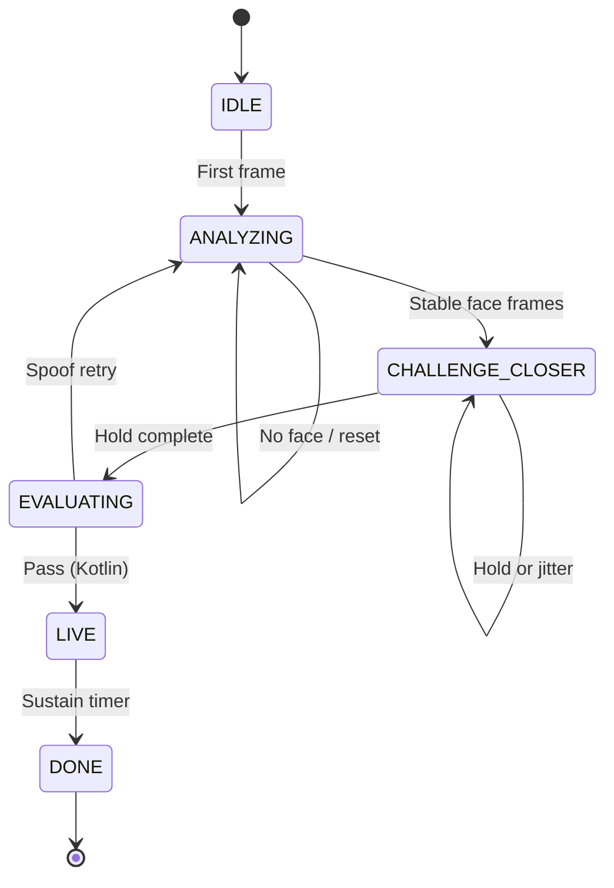
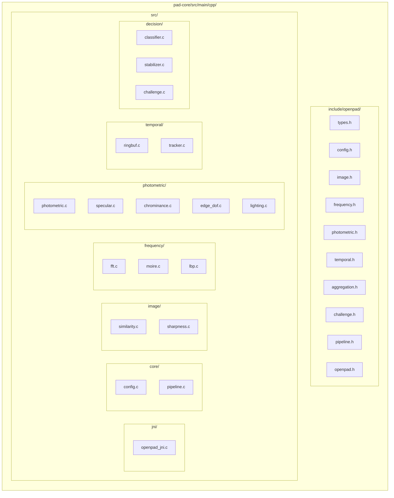
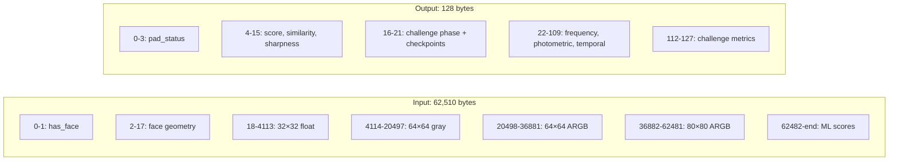
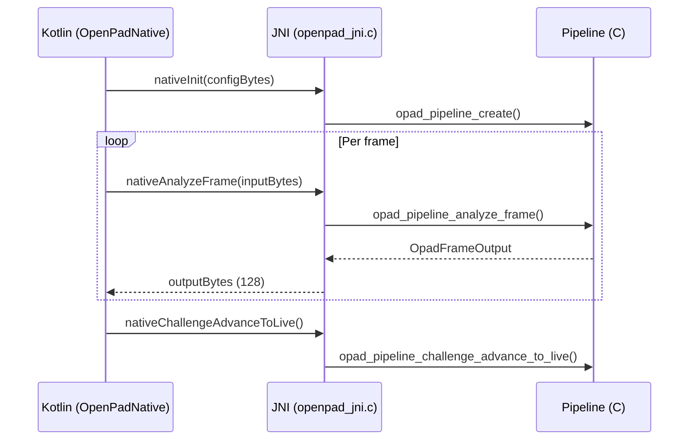

# OpenPAD Native Layer (C)

Pure C implementation of the OpenPAD signal-processing pipeline: FFT moiré detection, LBP screen analysis, photometric analysis, temporal tracking, classification, and challenge-response state machine. Built with the Android NDK, 16KB page-aligned for Android 15+.

Frame enhancement (ESPCN x2 super-resolution) runs in the Kotlin/TFLite layer, not in the native layer. The native pipeline receives already-enhanced bitmaps transparently.

---

## Architecture Overview



---

## Per-Frame Data Flow



---

## Module Dependency Graph



---

## Classification Gate Flow

Per-frame classification uses sequential decision gates. The first gate that fires determines the status.



---

## Challenge State Machine



---

## Directory Structure



| Directory | Purpose |
|-----------|---------|
| `include/openpad/` | Public API headers. Include via `#include <openpad/types.h>`. |
| `src/jni/` | JNI bridge — serializes Kotlin ↔ C wire format. |
| `src/core/` | Config parsing and pipeline orchestrator. |
| `src/image/` | Frame similarity (MAD) and face sharpness (Laplacian). |
| `src/frequency/` | FFT moiré (2D Cooley-Tukey) and LBP screen detection. |
| `src/photometric/` | Specular, chrominance, edge DOF, lighting — four sub-analyzers. |
| `src/temporal/` | Ring buffer and temporal feature tracker. |
| `src/decision/` | Classifier, stabilizer, challenge state machine. |

---

## Wire Format (JNI)



| Buffer | Size | Layout |
|--------|------|--------|
| **Config** | 172 bytes | 21×float (0-83), padding (84-127), 11×int32 (128-171) |
| **Input** | 62,510 bytes | Face + downsampled frame + face crops + ML scores |
| **Output** | 128 bytes | Status, scores, challenge state, all module results |

---

## Build

```bash
# From project root — CMake is invoked by Gradle
./gradlew :pad-core:assembleDebug

# Or build the full app
./gradlew :app:assembleDebug
```

The native library is built via `externalNativeBuild` in `pad-core/build.gradle.kts`. CMake produces `libopenpad.so` for `arm64-v8a` and `x86_64`.

### Build Requirements

- Android NDK (r27+ recommended)
- CMake 3.22+
- C99 compiler (Clang)

### 16KB Page Alignment

For Android 15+ compatibility, the library is linked with:

```
-Wl,-z,max-page-size=16384
```

---

## Public API Summary

| Module | Key Functions |
|--------|---------------|
| **Config** | `opad_config_default()`, `opad_config_parse()` |
| **Image** | `opad_compute_frame_similarity()`, `opad_compute_face_sharpness()` |
| **Frequency** | `opad_fft_moire()`, `opad_lbp_screen()` |
| **Photometric** | `opad_photometric_analyze()` |
| **Temporal** | `opad_temporal_tracker_create()`, `opad_temporal_tracker_update()`, `opad_temporal_tracker_reset()` |
| **Aggregation** | `opad_classify()`, `opad_compute_aggregate_score()`, `opad_stabilizer_*()` |
| **Challenge** | `opad_challenge_create()`, `opad_challenge_on_frame()`, `opad_challenge_advance_to_live()` |
| **Pipeline** | `opad_pipeline_create()`, `opad_pipeline_analyze_frame()`, `opad_pipeline_reset()` |

All symbols use the `opad_` prefix (functions) or `Opad` / `OPAD_` prefix (types) to avoid collisions.

---

## Kotlin Integration

The Kotlin layer (`com.openpad.core.ndk.OpenPadNative`) loads the library and calls JNI functions:



---

## Contributing

When modifying the native layer:

1. **Keep C99** — no C11+ features; ensures broad NDK compatibility.
2. **Preserve `opad_` prefix** — all public symbols must be prefixed.
3. **Update wire format docs** — if changing input/output layout, document it here and in `OpenPadNative.kt`.
4. **Run the build** — `./gradlew :pad-core:assembleDebug` must succeed for `arm64-v8a` and `x86_64`.

---

## License

Same as the parent OpenPAD project.
